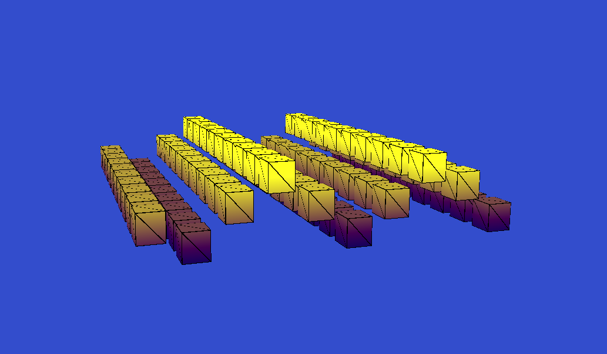

# From Pixels to Blocks
### A Color-Based 3D Transformation System


Created by: Cocoboyy


## Overview
This project explores the transformation of 2D image data into volumetric 3D block-based models.

Using color as the primary guiding parameter, combined with structural and spatial analysis—the system reconstructs images into layered modular 3D forms.
The system converts image pixels into 3D cubes, where color intensity and structure determine the height and arrangement of blocks.

## Features
- 2D image parsing
- Function parsing
- Color-driven spatial analysis
- Grid-based square generation
- Volumetric cube transformation
- Modular 3D structure reconstruction

## How It Works

- Each pixel is mapped to a square in a 2D grid.
- Color intensity determines cube height.
- The grid is extruded into 3D space.
- Lighting and shading enhance depth perception using viridis color scale.

## Technologies Used
- C++
- OpenGL
- GLSL
- GLFW / GLAD 

## Requirements

- C++17 compatible compiler (GCC 9+, Clang 10+, MSVC 2019+)
- CMake 3.15+
- OpenCV 4.12.0+
- OpenGL 3.3+ compatible GPU

## Clone the Repository

```bash
git clone https://github.com/X2Ca/from-pixels-to-blocks.git
cd from-pixels-to-blocks

```

## Build Instructions

### 🔹 If Using CMake (Recommended)

## Build

```bash
mkdir build
cd build
cmake ..
cmake --build .

```

Or:

```bash
cmake -S . -B build
cmake --build build

```


## Use

## Function Graph Mode

- Select the grid resolution
- Enter a function of x and y

## Picture Mode

- Select the grid resolution
- Type the path of your image (e.g ``from-pixels-to-blocks/images/la_joconde.jpg``)

### Rotation
- ⬅️ / ➡️ : Rotate left / right
- ⬆️ / ⬇️ : Rotate up / down

### Movement
- ``Z`` : Move forward
- ``S`` : Move backward
- ``Q`` : Move left
- ``D`` : Move right

## Roadmap
- [x] Generate full 2D grid
- [x] Convert squares into cubes
- [x] Add lighting & shading
- [ ] Export 3D model
- [ ] Optimize performance

## Screenshots




## License
MIT
